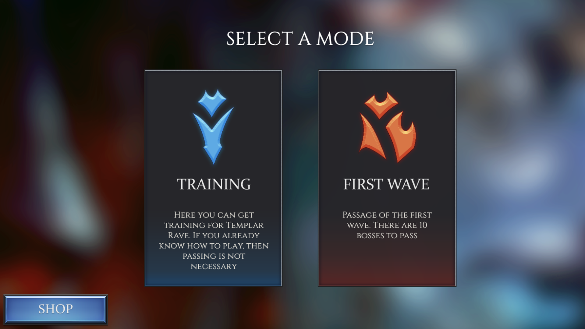

# Templar Rave
> Разрабатывается на GMS 2.3 с использованием BBMOD для Android.

# Содержание
* [Описание](#описание)
* [Скриншоты](#скриншоты)
* [Видео](#видео)
* [Ссылки](#ссылки)
* [Особые благодарности](#особые-благоларности)

# Описание

Игра представляет из себя аркаду с элементами кликера и RPG на Android. В настоящее время разрабатывается одним человеком. Данный репозиторий содержит очень малую часть исходного кода, полный и актуальный проект находится в приватном репозитории.

# Скриншоты

# Видео

https://youtu.be/4tx9bAmy9bA

# Ссылки
* [Discord](https://discord.gg/uYHrRyDd)

# Особые благодарности
* Blueburn'у за предоставление BBMOD
